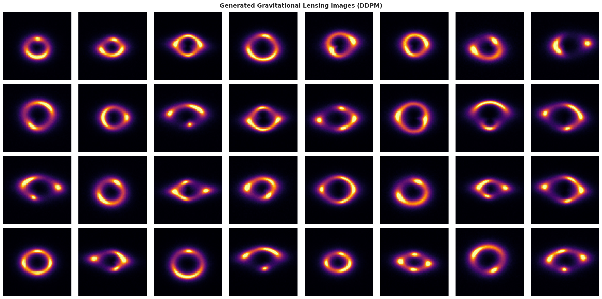
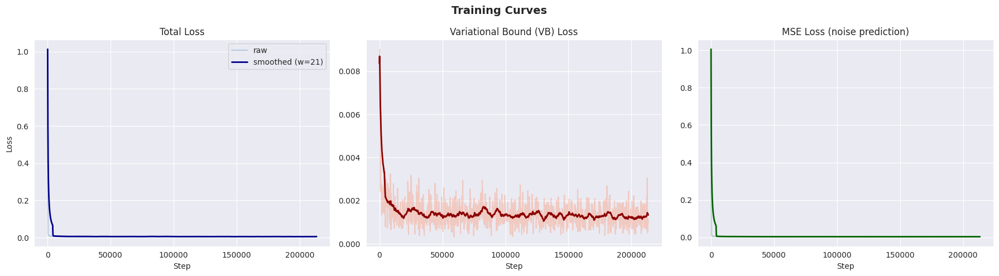
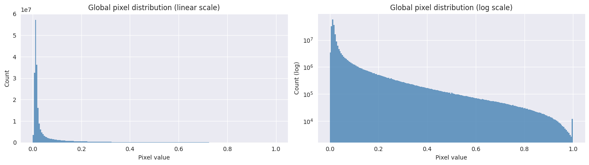
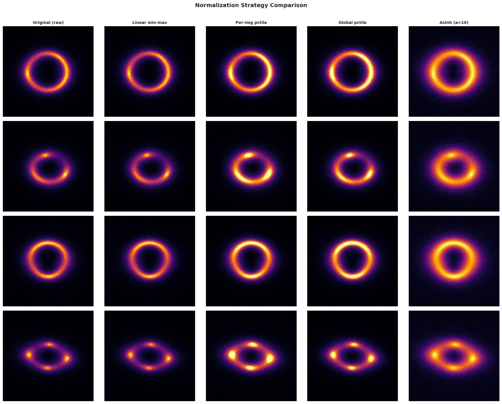

# Diffusion Models for Gravitational Lensing Simulation

Common Test VIII for **DeepLense / ML4SCI (GSoC 2026)** — [Physics-Informed Diffusion Models for Gravitational Lensing Simulation](https://ml4sci.org/gsoc/2026/proposal_DEEPLENSE8.html).


**Author:** Xinming (Tina) Shen · Johns Hopkins University · xshen43@jh.edu


## Results

**FID = 2.20** (1,000 generated images vs 1,000 real images, 64×64, `clean-fid`)

Trained a DDPM via [guided-diffusion](https://github.com/openai/guided-diffusion) for 210k steps on the provided 10,000 lensing images. Best checkpoint at step 145k by smoothed training loss.

### Real vs Generated



### Generated Samples


### Training Curves



## Approach

### Data

The dataset contains 10,000 single-channel 150×150 images (float64, range [0, 1]). The pixel distribution is heavily skewed — median 0.017 vs mean 0.061 — because most pixels are dark background with sparse bright arcs.



### Preprocessing

`guided-diffusion` expects uint8 PNGs. I compared linear scaling, percentile clipping, and asinh stretch:



Went with **per-image percentile clipping (1st–99th percentile)** — it adapts to each image's dynamic range and avoids wasting the 8-bit range on outlier bright pixels. Images are then resized to 64×64 via Lanczos.

### Model

| Setting | Value |
|---|---|
| Architecture | U-Net (guided-diffusion) |
| Image size | 64×64 |
| Base channels | 128 |
| Res blocks | 2 |
| Attention | 16×16 |
| Learned sigma | Yes |
| Scale-shift norm | Yes |
| Noise schedule | Cosine |
| Diffusion steps | 1000 |
| LR / batch / FP16 | 1e-4 / 16 / Yes |
| Training steps | 210,000 (~3h on T4) |

Cosine schedule over linear because it allocates more noise budget to low-noise timesteps, which matters more for relatively simple 64×64 images (Nichol & Dhariwal, 2021). Learned sigma and scale-shift norm are from the improved DDPM line of work.

## Potential Directions

Things I'd explore with more time/compute:

- **Higher resolution** (128, 256) to recover fine arc/ring detail lost at 64×64
- **Ablation** on noise schedule (linear vs cosine), learned sigma, scale-shift norm
- **DDIM sampling** for faster inference at comparable quality
- **Flow matching with DiT** — FlowLensing (Sayed et al. 2025) got FID 1.6 this way
- **Physics constraints** — the main focus of the proposed GSoC project

## How to Run

Open `ddpm_gravitational_lensing.ipynb` in Colab with a T4 GPU. Place `Samples/` (containing `sample1.npy` through `sample10000.npy`) under:

```
/content/drive/MyDrive/Colab Notebooks/GoSC26/ML4DQM_7/
```

Run all cells. Training takes ~3 hours for 210k steps at 64×64.

## References

1. Ho et al. (2020). Denoising Diffusion Probabilistic Models. NeurIPS.
2. Nichol & Dhariwal (2021). Improved DDPM. ICML.
3. Dhariwal & Nichol (2021). Diffusion Models Beat GANs. NeurIPS.
4. Sayed et al. (2025). FlowLensing: Simulating Gravitational Lensing with Flow Matching.
